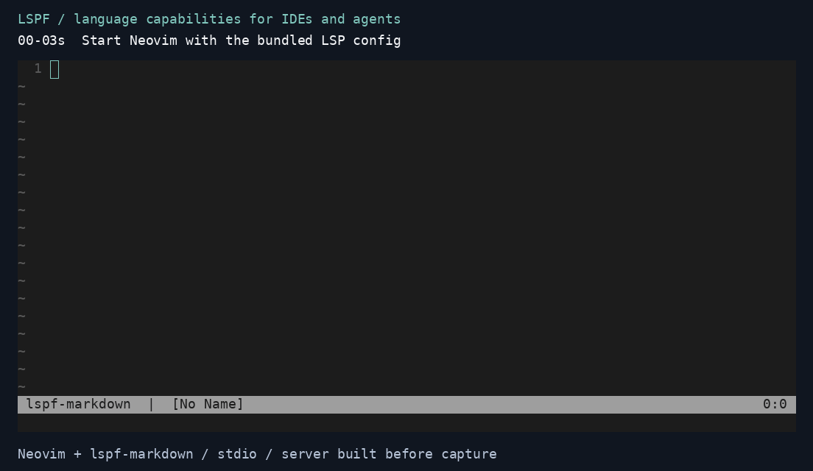

# lspf

[](https://crates.io/crates/lspf)
[](https://docs.rs/lspf)
[](#license)
[](https://deepwiki.com/meymchen/lspf)

Build language capabilities in Rust for IDEs and AI agents.
LSPF provides the Language Server Protocol runtime for both servers and clients.

[Docs](https://lspf.dev) · [crates.io](https://crates.io/crates/lspf) ·
[API](https://docs.rs/lspf) · [Examples](./crates/lspf/examples/README.md) ·
[简体中文](https://lspf.dev/zh-cn/)

- Complete stable LSP 3.18 feature catalog, with capabilities generated from registrations.
- Framework-owned documents, workspace state, and position encoding negotiation.
- Cancellation, bounded concurrency, and partial results.
- stdio, TCP, WebSocket, WASM worker channels, and custom transports.
- Typed Client calls and supervised language-server processes for IDE and Agent hosts.

Try a working server: [run the Markdown demo in Neovim](./docs/editors/neovim.md),
[VS Code](./docs/editors/vscode.md), or [Zed](./docs/editors/zed.md).
To build your own, start with the example below.

## Minimal example

A hover handler that reads the document managed by LSPF. Save this as
`src/main.rs` with the [dependencies below](#install), then run `cargo build`.

```rust,no_run
use std::sync::Arc;
use lspf::types::{Hover, HoverContents, HoverParams, MarkupContent, MarkupKind};
use lspf::{CancellationToken, LspError, Server, ServerContext};

async fn hover(
    _state: Arc<()>,
    ctx: ServerContext,
    params: HoverParams,
    _cancel: CancellationToken,
) -> Result<Option<Hover>, LspError> {
    let uri = params.text_document_position_params.text_document.uri;
    Ok(ctx.documents().get(&uri).map(|doc| Hover {
        contents: HoverContents::MarkupContent(MarkupContent {
            kind: MarkupKind::PlainText,
            value: format!("{} words", doc.text().split_whitespace().count()),
        }),
        range: None,
    }))
}

#[tokio::main]
async fn main() -> lspf::Result<()> {
    let server = Server::builder(())
        .feature(lspf::features::hover(), hover)
        .build()
        .expect("valid registrations");
    let outcome = lspf::stdio(server).serve().await?;
    std::process::exit(outcome.code());
}
```

Point your editor's LSP command at `target/debug/my-language-server`.
Opening a document and hovering returns its word count; LSPF handles
initialization, synchronization, and shutdown. The
[server tutorial](https://lspf.dev/tutorials/server) adds diagnostics and commands.

## See it work in 30 seconds



`lspf-markdown` checks local Markdown links, shows their resolved targets on
hover, and jumps to target headings. This is a real Neovim session using the
in-tree server over stdio. [Replay or record the demo](./docs/demo.md).

```bash
git clone https://github.com/meymchen/lspf.git
cd lspf
cargo install --path crates/lspf-markdown --locked
nvim --clean -u editor-validation/neovim/init.lua editor-validation/fixture/readme.md
```

Requires Rust 1.98+, Neovim 0.11+, and Cargo's bin directory on `PATH`.
Compilation happens before the 30-second demo. Put the cursor inside
`missing.md` to inspect the diagnostic, then inside `guide.md` for hover and
definition. The [Neovim quick start](./docs/editors/neovim.md) includes explicit
commands and a small configuration you can adapt to your own server.

## Why LSPF?

### Let the framework own the protocol runtime

Register the language operations your application needs with
`.feature(lspf::features::hover(), hover)` or
`.feature(lspf::features::completion(options), complete)`, as in the
[expanded example below](#quick-start).

LSPF owns initialize, shutdown and exit, JSON-RPC dispatch, document
synchronization, workspace state, and UTF-8/UTF-16/UTF-32 position negotiation.
It also provides cancellation tokens, bounded concurrent dispatch,
request-scoped partial results, typed server-to-client requests, and transport
adapters. Handlers access this state through `ServerContext`.

Documents are updated before document hooks run. Capabilities come from the
same registrations that dispatch requests; conflicting registrations fail
at build time. Your application owns parsing, indexing, analysis, and the
policy for using those results.

### Extend language capabilities for IDEs and agents

A definition handler can power an editor's navigation action or an agent's
source lookup through LSP. Diagnostics can appear in an editor or feed an
automated edit-and-check loop. Implement the operation once in a server and
expose it to hosts that speak the protocol.

LSPF also supplies the Client endpoint. An IDE or Agent host can launch a
language server as a supervised stdio child, receive diagnostics, and issue
typed requests through `ServerHandle`:

```rust,no_run
#[tokio::main]
async fn main() -> Result<(), Box<dyn std::error::Error>> {
    let child = lspf::Client::builder(lspf::types::ClientCapabilities::default())
        .spawn(tokio::process::Command::new("lspf-markdown"))
        .await?;
    let _server = child.server();
    // Send document notifications and typed requests through `_server`.
    // Keep `child` alive while the host uses the connection.
    let output = child.shutdown().await?;
    assert!(output.status().success());
    Ok(())
}
```

The [Client tutorial](https://lspf.dev/tutorials/client) is a runnable host that
opens a document, receives diagnostics, requests hover, and executes a command.
Use it as the starting point for an Agent's code tools. The host owns document
contents and versions, tool schemas, model integration, and decisions about
applying edits. LSPF supplies the typed protocol connection and process lifecycle.

### Keep language logic independent of the host

Use stdio for a local editor or Agent process, TCP or WebSocket for a native
connection, or worker channels in a WASM host. The
[transport examples](./crates/lspf/examples/README.md#transport-examples)
reuse shared handlers. Custom `Transport` implementations can connect an
embedded host or a test peer to the same protocol engine.

## Quick start

Create a binary crate:

```bash
cargo new my-language-server
cd my-language-server
```

Add the dependencies under [Install](#install), then paste the minimal example
into `src/main.rs` and run `cargo build`. Launch the resulting executable
through an LSP client; it waits for protocol messages on stdin. Write logs to
stderr because stdout carries the protocol.

The expanded example below adds completion, a workspace command, disk access,
and tracing.

```rust,no_run
use std::sync::Arc;

use lspf::types::{
    CompletionItem, CompletionItemKind, CompletionOptions, CompletionParams, CompletionResponse,
    Hover, HoverContents, HoverParams, MarkupContent, MarkupKind,
};
use lspf::{CancellationToken, ServerContext, LspError, OsFileProvider, Server};

/// Only your own application state — the framework owns the documents, the
/// workspace, and the client, and hands them to handlers through `ServerContext`.
struct State;

/// A standard typed feature. The `features::hover()` descriptor fixes the
/// wire method, this handler's parameter and result types, and the
/// `hoverProvider` capability the server will advertise — all at once.
async fn hover(
    _state: Arc<State>,
    ctx: ServerContext,
    params: HoverParams,
    _ct: CancellationToken,
) -> Result<Option<Hover>, LspError> {
    let uri = params.text_document_position_params.text_document.uri;
    let Some(document) = ctx.documents().get(&uri) else {
        return Ok(None);
    };
    Ok(Some(Hover {
        contents: HoverContents::MarkupContent(MarkupContent {
            kind: MarkupKind::PlainText,
            value: format!("{} words", document.text().split_whitespace().count()),
        }),
        range: None,
    }))
}

/// A second typed feature; the options supplied here are exactly what the
/// generated `completionProvider` advertises.
async fn complete(
    _state: Arc<State>,
    _ctx: ServerContext,
    _params: CompletionParams,
    _ct: CancellationToken,
) -> Result<Option<CompletionResponse>, LspError> {
    Ok(Some(CompletionResponse::CompletionItemList(vec![CompletionItem {
        label: "hello".into(),
        kind: Some(CompletionItemKind::Text),
        ..CompletionItem::default()
    }])))
}

/// A typed Command, dispatched by name beneath `workspace/executeCommand`.
/// Registering it adds the name to the generated `executeCommandProvider`,
/// in registration order.
async fn roots(
    _state: Arc<State>,
    ctx: ServerContext,
    _args: Vec<String>,
    _ct: CancellationToken,
) -> Result<Vec<(String, String)>, LspError> {
    Ok(ctx
        .workspace()
        .roots()
        .into_iter()
        .map(|folder| (folder.uri.as_str().to_string(), folder.name))
        .collect())
}

#[tokio::main]
async fn main() -> lspf::Result<()> {
    // Logs go to stderr: stdout carries the LSP wire protocol and nothing else.
    tracing_subscriber::fmt()
        .with_writer(std::io::stderr)
        .with_ansi(false)
        .with_env_filter(tracing_subscriber::EnvFilter::from_default_env())
        .init();

    let server = Server::builder(State)
        // Unopened `file:` URIs resolve from disk through this provider.
        .file_provider(OsFileProvider::new())
        .feature(lspf::features::hover(), hover)
        .feature(
            lspf::features::completion(CompletionOptions {
                trigger_characters: Some(vec![".".to_string()]),
                ..CompletionOptions::default()
            }),
            complete,
        )
        .command("hello.roots", roots)
        .build()
        .expect("the static registrations are valid");
    // Serving reports how the connection ended; the binary decides what that
    // means for the process.
    let outcome = lspf::stdio(server).serve().await?;
    std::process::exit(outcome.code());
}
```

No handwritten `ServerCapabilities` and no framework change are involved:
the capabilities come from the registrations themselves. For a ready-to-copy
server and VS Code extension, start from
[`lspf-vscode-extension-template`](https://github.com/meymchen/lspf-vscode-extension-template).
The framework's public feature, workspace, client, and stdio seams are covered
by the `crates/lspf` integration tests and the in-tree `lspf-markdown`
reference server. The
[feature registration](https://lspf.dev/guides/features-and-workspace)
and [workspace state](https://lspf.dev/guides/workspace-state)
guides walk through each piece. To choose a Transport adapter, enable only
its Cargo dependencies, or implement another message-framed channel, see
[Choosing a Transport](https://lspf.dev/guides/transports), then
continue to [stdio and custom transports](https://lspf.dev/guides/stdio-and-custom-transports)
when the host owns a child process or a custom message-framed channel.
To build the same server one step at a time, start with the
[Server tutorial](https://lspf.dev/tutorials/server), then use the
[Client tutorial](https://lspf.dev/tutorials/client) to drive it as a supervised
stdio child. For custom Client Transports and reverse handlers, follow the
[Client adoption guide](https://lspf.dev/guides/client-adoption).
Runnable servers for individual LSP features are indexed in
[`crates/lspf/examples/README.md`](./crates/lspf/examples/README.md).

## Install

```toml
[dependencies]
lspf = "1.0.0"
tokio = { version = "1", features = ["macros", "rt-multi-thread", "process"] }
tracing = "0.1"
tracing-subscriber = { version = "0.3", features = ["env-filter"] }
```

The crate requires Rust 1.98 or newer. The minimal example needs only `lspf` and `tokio`; the expanded example also uses the tracing dependencies. Both examples use the default `stdio`
feature; select a different feature set for another Transport.

List every crate your application names directly. Tokio's `process` feature
is included for the Client example. The expanded server uses
`tracing-subscriber` to configure framework logs on stderr.

## Editor quick starts

All three guides use the same `lspf-markdown` executable and fixture:

- [Neovim](./docs/editors/neovim.md): built-in LSP, no plugin required.
- [VS Code](./docs/editors/vscode.md): the bundled language-client extension.
- [Zed](./docs/editors/zed.md): the bundled development extension.

For a new server and VS Code extension, use the
[`lspf-vscode-extension-template`](https://github.com/meymchen/lspf-vscode-extension-template).
For individual protocol operations, browse the
[runnable examples](./crates/lspf/examples/README.md).
The [editor validation journeys](./editor-validation/README.md) record the
shared protocol checks and editor observations.

## Concepts

The vocabulary below is taken from [`CONTEXT.md`](./CONTEXT.md); the
project deliberately standardizes on these terms in the public API and
the docs.

| Term                | Meaning                                                                                                  |
| ------------------- | -------------------------------------------------------------------------------------------------------- |
| `Server`            | Owns exactly one LSP connection; built by `Server::builder(state)` and served over a `Transport`.        |
| Handler             | An async function registered for one LSP method. User handlers take priority over the built-ins.         |
| Built-in handler    | A handler the framework ships. Lifecycle, document sync, and cancellation are protocol built-ins.        |
| Post-mutation hook  | What registering a built-in document notification records: it observes the mutation, never replaces it.  |
| `Command`           | A user closure dispatched by name on `workspace/executeCommand`.                                         |
| `Document`          | A text resource tracked by the framework: URI, language id, version, and rope-backed contents.           |
| `DocumentsView`     | The read-only document handle a handler reaches through `ctx.documents()`.                               |
| `NotebooksView`     | The read-only notebook handle a handler reaches through `ctx.notebooks()`: structure, not cell text.     |
| `Workspace`         | The cloneable handle to the connection's workspace state: folders, configuration, and documents.         |
| `FileProvider`      | The configurable resolver for resources that are not open in the editor.                                 |
| `ServerContext`     | The cheap-to-clone framework-state handle every handler receives: documents, workspace, client, scope.   |
| `ClientHandle`      | The typed handle for server-to-client notifications and requests (`ctx.client()`).                       |
| `PartialResultSink` | The request-scoped typed sink for result chunks, lent by `ctx.partial_results()`.                        |
| `Client`            | Configures one outbound LSP connection over a caller-provided Transport or supervised stdio child.       |
| `ClientConnection`  | Owns one initialized generic Client connection and its inbound protocol driver.                          |
| `ClientContext`     | The protocol-only context passed to reverse handlers; editor state remains caller-owned.                 |
| `ServerHandle`      | The cloneable handle for typed client-to-server calls and Client lifecycle transitions.                  |
| `ChildConnection`   | Owns one initialized stdio Client connection and its supervised language-server process.                 |
| `CancellationToken` | The cancellation signal passed to request handlers.                                                      |
| `Transport`         | A message-framed channel split into reader and writer halves for the protocol engine.                    |
| `Outcome`           | How one connection ended, returned by serving; it carries the LSP exit code but never exits the process. |

## Architecture

The [project documentation](https://lspf.dev) covers
features, transports, testing, operations, and both endpoint tutorials. The
repository keeps the material needed to maintain those contracts:

- [`CONTEXT.md`](./CONTEXT.md) defines the domain language.
- [`docs/adr/`](./docs/adr/) records architecture decisions.
- [`docs/public-interface.md`](./docs/public-interface.md) freezes the 1.0
  public interface.
- [`SECURITY.md`](./SECURITY.md) defines supported platforms, compatibility,
  and vulnerability reporting.

See [`CONTRIBUTING.md`](./CONTRIBUTING.md) before changing these boundaries.

## Current scope

See the [package changelog](./crates/lspf/CHANGELOG.md) for release history.

The [support contract](./SECURITY.md) is authoritative for maintained Rust
versions, hosts, targets, and Cargo feature combinations. The
[operations guide](https://lspf.dev/guides/operations#known-limitations) records the
deployment and application responsibilities that lspf deliberately leaves to
its host.

Available today:

- `stdio`, single-client TCP, WebSocket, and WASM worker-channel adapters, plus
  the public custom-transport interface.
- A typed Client endpoint over custom Transport and supervised stdio child,
  with reverse handlers, bounded resources, deadlines, and lifecycle control.
- The built `Server`: typed requests, notifications, commands, the sealed
  feature catalog covering the complete stable LSP 3.18 surface, user `Layer`s, and
  the one `configure_initialize` transaction. The 3.18 additions are
  `textDocument/inlineCompletion`, `workspace/textDocumentContent`, and
  `textDocument/rangesFormatting`.
- Lifecycle hooks through shutdown and exit, incremental or full text-document
  synchronization, and post-mutation document hooks.
- Notebook document synchronization across
  `notebookDocument/didOpen`, `didChange`, `didSave`, and `didClose`, with
  notebook structure read through `ctx.notebooks()` and cell text through the
  same `ctx.documents()` view as any other document.
- The multi-root `Workspace`, latest configuration settings, and
  `FileProvider`-backed unopened-file lookup.
- Typed server-to-client notifications and correlated requests through
  `ClientHandle`, including all seven stable workspace refresh requests.
- Partial-result reporting: a handler for a request that carries
  a `partialResultToken` reports typed chunks through `ctx.partial_results()`
  under the connection's outbound budget.
- Concurrent dispatch, bounded concurrency, request cancellation, and
  `tracing` spans.
- Rope-backed documents with UTF-8/UTF-32/UTF-16 position negotiation.

## Contributing

Read [`CONTRIBUTING.md`](./CONTRIBUTING.md) for setup, project context, tests,
documentation rules, debugging, and pull request conventions. Issues live on
the [GitHub tracker](https://github.com/meymchen/lspf/issues).

## License

Dual-licensed under either of

- [Apache License, Version 2.0](./LICENSE-APACHE)
- [MIT License](./LICENSE-MIT)

at your option.
